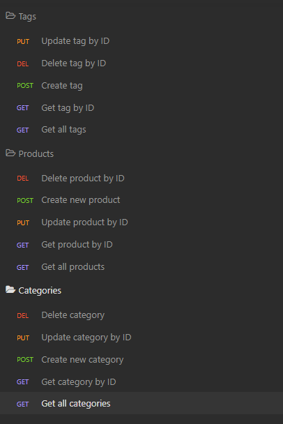

## online-store-backend

# Description
This application is a tool for ecommerce professionals organizing their site's back end data..  There are routes where models of categories, products, and tags in the store are able to be created, retrieved, updated, and deleted.  The models are also connected so if the user updates a category, its associated products stay with it.  If the user delete a tag, its removed from all of its products.  

Although the assignment was challenging, it was a fun one.  Routing is an interesting topic, and it was great to see them come together.

# Contributors
I wrote the code but received help from my classmate Sam, TA Michael, instructor John, and several BCS tutors.

# Usage
In order to use this app, you will need Node, NPM, Sequelize, MySQL, and Insomnia.  

# Testing
To test the app, first open a terminal and copy the ```.env.EXAMPLE``` file as a ```.env```, then place your MySQL information in it.  Then run the ```npm-i``` command if you haven't already.  Then, in the terminal type ```mysql -u root -p <db/schema.sql``` and then ```npm run seed``` to set up and seed the database.

Then you will type ```npm start```.  This will start the server, and you can then view the various requests via Insomnia.

[Refer to this video if you are having challenges getting the app set up](https://drive.google.com/file/d/1s4EuJGmRmAmhNhMHJDfhYfgv50Kwp6Ff/view)

I have also attached a screenshot below for what the requests in Insomnia should look like.


# License
Matt Carlson Code 2022